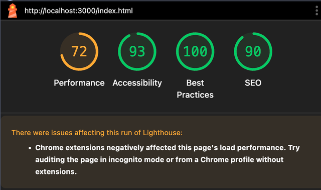
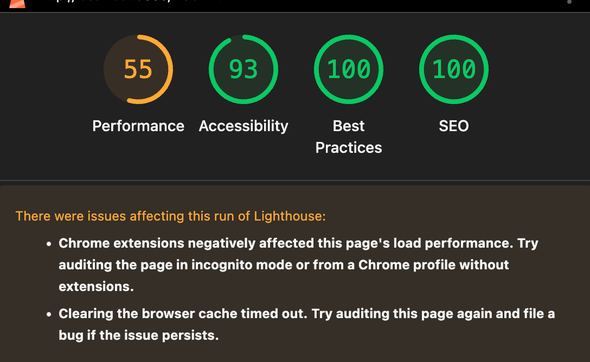

# Group-3-Core-E-Commerce-Build
ITMGT 45.03 YZW GC 2

Layer	            Technology	               Version	                  Purpose
Frontend	    HTML5, CSS3, JavaScript (Vanilla)	—	               UI pages and cart logic
Backend	        Node.js + Express.js	           18.x	         REST API for products and orders
Database	    JSON file (mock DB)	   	            -                    Order persistence
External API	Zippopotam.us	                    -               Live ZIP → City lookup
Hosting	Netlify	   	  -                             -                    Frontend deployment
Hosting	Render	  	  -                             -                    Backend deployment

Running the Backend
    cd server
    npm install
    node index.js
The backend runs at: http://localhost:8000

Running the Frontend

    python3 -m http.server 3000
Frontend runs at: http://localhost:3000

API Documentation
Base URL (Local): http://localhost:8000
Base URL (Live): https://unithrift-backend.onrender.com

Endpoints
GET /api/products
Returns a list of available products.

POST /api/cart/checkout
Creates a mock order record.

GET /api/orders
Returns all stored orders (from orders.json).

Live API Integration

Uses the Zippopotam.us API: GET https://api.zippopotam.us/ph/{ZIPCODE}

SEO

Added meta tags: description, keywords, author, Open Graph data.
Mobile-responsive design (viewport tag).
Reduced inline script repetition, optimized DOM lookups.

Before SEO

After SEO

Limitations

Uses a local JSON file for persistence (not a real database).
Authentication not implemented – all users share the same cart/order flow.
Render cold starts may cause a 5–10s delay on first backend load.
ZIP API occasionally fails for less common postal codes.